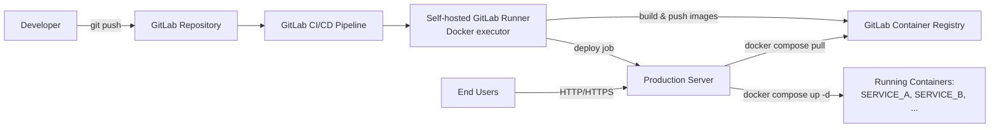
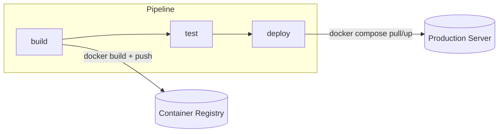
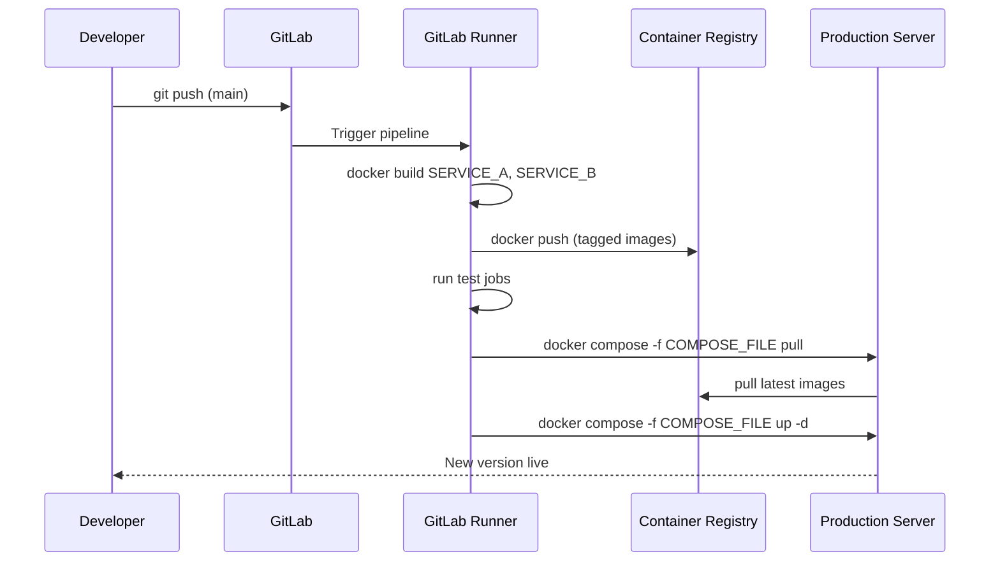

# GitLab CI/CD + Docker Deployment Guide

A reference for deploying multi-service applications using **GitLab**, a **self-hosted GitLab Runner**, **Docker**, **Docker Compose**, and the **GitLab Container Registry**.

---

## 1. Overview

When a developer finishes some code, they push it to GitLab. From there, everything happens automatically:

1. GitLab notices the new code and kicks off a **pipeline** — an automated sequence of steps.
2. The pipeline **builds** the application into Docker images (self-contained packages that include the app and everything it needs to run) and **tests** that the app still works correctly.
3. If the tests pass, the finished images are uploaded to GitLab's built-in **Container Registry** — think of it as a private app store for these packages.
4. The production server is then told to **pull** the newest images from that registry and restart the application using them.

The key idea: the production server never needs the full source code checked out. It only needs Docker installed, permission to reach the registry, and a small configuration file (`docker-compose.yml`) that says which images to run and how. This keeps deployments fast, consistent, and easy to roll back — the server always just downloads a ready-made package rather than rebuilding the app from scratch.

---

## 2. Architecture at a Glance



### Pipeline stages



### Deploy-time sequence



**Important:** the production server clones the app repository once (or not at all if the compose file is deployed separately). Day-to-day deploys only require Docker, registry credentials, and the compose file — not a fresh `git clone` of application source.

---

## 3. Repository Shape

```
GROUP/PROJECT/
├── .gitlab-ci.yml
├── docker-compose.yml
├── SERVICE_A
│   ├── Dockerfile
│   ├── requirements.txt (or package.json, etc.)
│   └── ... app source ...
├── SERVICE_B/
│   ├── Dockerfile
│   ├── package.json
│   └── ... app source ...
└── .env.example  
```

- Each service folder owns its `Dockerfile`.
- `docker-compose.yml` at the root (or deployed separately to the server) references **registry images**, not local build contexts, for production use.
- Runtime configuration can live either in the compose file's `environment:` block or in a server-side `.env` file referenced via `env_file:`. Document whichever your team uses — both are shown below.

---

## 4. Example `.gitlab-ci.yml`

```yaml
stages:
  - build
  - test
  - deploy

variables:
  IMAGE_A: "$CI_REGISTRY_IMAGE/SERVICE_A"
  IMAGE_B: "$CI_REGISTRY_IMAGE/SERVICE_B"
  COMPOSE_FILE: "/home/USER/app/docker-compose.yml"

# ---------- BUILD ----------

build:service_a:
  stage: build
  tags: [tag]
  image: docker:latest
  services: []   # using host Docker socket, not dind — see Runner Setup
  script:
    - echo "$CI_REGISTRY_PASSWORD" | docker login -u "$CI_REGISTRY_USER" --password-stdin "$CI_REGISTRY"
    - docker build --provenance=false --sbom=false
        -t "$IMAGE_A:$CI_COMMIT_SHORT_SHA" -t "$IMAGE_A:latest" ./SERVICE_A
    - docker push "$IMAGE_A:$CI_COMMIT_SHORT_SHA"
    - docker push "$IMAGE_A:latest"
  rules:
    - if: '$CI_COMMIT_BRANCH == "main" || $CI_COMMIT_BRANCH == "master" || $CI_COMMIT_BRANCH == "develop"'

build:service_b:
  stage: build
  tags: [tag]
  image: docker:latest
  script:
    - echo "$CI_REGISTRY_PASSWORD" | docker login -u "$CI_REGISTRY_USER" --password-stdin "$CI_REGISTRY"
    - docker build --provenance=false --sbom=false
        -t "$IMAGE_B:$CI_COMMIT_SHORT_SHA" -t "$IMAGE_B:latest" ./SERVICE_B
    - docker push "$IMAGE_B:$CI_COMMIT_SHORT_SHA"
    - docker push "$IMAGE_B:latest"
  rules:
    - if: '$CI_COMMIT_BRANCH == "main" || $CI_COMMIT_BRANCH == "master" || $CI_COMMIT_BRANCH == "develop"'

# ---------- TEST ----------

test:service_a:
  stage: test
  tags: [tag]
  image: python:3.12-slim   # example; use node:XX-slim, etc. as needed
  variables:
    PYTHONPATH: "."
  script:
    - pip install -r SERVICE_A/requirements.txt
    - pytest SERVICE_A/tests

test:service_b:
  stage: test
  tags: [tag]
  image: node:20-slim
  script:
    - cd SERVICE_B
    - npm ci
    - npm test

# ---------- DEPLOY ----------

deploy:production:
  stage: deploy
  tags: [tag]
  image: docker:latest
  script:
    - echo "$CI_REGISTRY_PASSWORD" | docker login -u "$CI_REGISTRY_USER" --password-stdin "$CI_REGISTRY"
    - docker compose -f "$COMPOSE_FILE" pull
    - docker compose -f "$COMPOSE_FILE" up -d
  rules:
    - if: '$CI_COMMIT_BRANCH == "main" || $CI_COMMIT_BRANCH == "master"'
```

Notes:
- `only`/`rules` restrict deploy to `main`/`master` (and build/test can also run on `develop`).
- `CI_REGISTRY`, `CI_REGISTRY_USER`, `CI_REGISTRY_PASSWORD`, and `CI_REGISTRY_IMAGE` are GitLab's predefined registry variables — no need to store separate registry secrets.
- `--provenance=false --sbom=false` avoids BuildKit attestation blobs that some registry configurations reject. If you still hit errors, also try setting `BUILDX_NO_DEFAULT_ATTESTATIONS=1` as a job variable.

---

## 5. Example `docker-compose.yml`

```yaml
services:
  service_a:
    image: registry.gitlab.com/GROUP/PROJECT/SERVICE_A:latest
    restart: unless-stopped
    env_file:
      - .env          # Option A: server-side env file
    environment:       # Option B: inline environment (pick one approach)
      - LOG_LEVEL=info
    ports:
      - "8000:8000"

  service_b:
    image: registry.gitlab.com/GROUP/PROJECT/SERVICE_B:latest
    restart: unless-stopped
    ports:
      - "80:80"
    depends_on:
      - service_a
```

This file lives on the server at a stable path, e.g. `/home/USER/app/docker-compose.yml`, and is what the deploy job targets. It does not need the rest of the repository alongside it.

---

## 6. GitLab Runner Setup (Self-Hosted, Docker Executor)

Config file location (typical): `/etc/gitlab-runner/config.toml`

```toml
[[runners]]
  name = "docker-runner"
  url = "https://gitlab.com/"
  token = "REDACTED"
  executor = "docker"

  [runners.docker]
    tls_verify = false
    image = "docker:latest"
    privileged = false
    disable_cache = false
    volumes = [
      "/var/run/docker.sock:/var/run/docker.sock",
      "/home/USER/app:/home/USER/app",
      "/cache"
    ]
```

Jobs opt into this runner with:

```yaml
tags: [tag]

---

## 7. Runbook

### 7.1 First-Time Setup Checklist

- [ ] Install Docker + Docker Compose plugin on the production server
- [ ] Install and register a self-hosted GitLab Runner (Docker executor) on the runner host
- [ ] Configure `/etc/gitlab-runner/config.toml` with the socket + volume mounts shown above
- [ ] Tag the runner (e.g. `docker`) and confirm it appears green/online in **Settings → CI/CD → Runners**
- [ ] Enable the project's Container Registry (**Settings → Packages and Registries**)
- [ ] Create `docker-compose.yml` on the production server at a known path (e.g. `/home/USER/app/docker-compose.yml`)
- [ ] Populate server-side `.env` (or compose `environment:` block) with production config/secrets
- [ ] Add `.gitlab-ci.yml` to the repo with build/test/deploy stages
- [ ] Do one manual `docker login` on the server to confirm registry credentials work:
  ```bash
  docker login registry.gitlab.com -u USER
  ```
- [ ] Trigger a pipeline manually and confirm all three stages go green
- [ ] Confirm the app is reachable at `http://SERVER_IP` (or your domain) after the first deploy

### 7.2 Everyday Deploy Checklist

- [ ] Push code to `main`/`master` (or merge an MR)
- [ ] Watch the pipeline in **CI/CD → Pipelines**
- [ ] Confirm build jobs pushed new image tags (check **Packages and Registries → Container Registry**)
- [ ] Confirm test jobs passed
- [ ] Confirm the deploy job ran `pull` and `up -d` without errors
- [ ] Spot-check the running containers on the server:
  ```bash
  docker compose -f /home/USER/app/docker-compose.yml ps
  docker compose -f /home/USER/app/docker-compose.yml logs --tail=100
  ```
- [ ] Verify the app in a browser / with a health-check request

### 7.3 Manual Deploy (If Needed Outside CI)

```bash
ssh USER@SERVER_IP
cd /home/USER/app
docker login registry.gitlab.com -u USER
docker compose -f docker-compose.yml pull
docker compose -f docker-compose.yml up -d
docker compose -f docker-compose.yml ps
```

### 7.4 Rollback

Since deploys are just "pull a tag and restart," rolling back means pointing compose at a previous tag:

```bash
# Example: pin to a known-good commit SHA tag instead of :latest
docker pull registry.gitlab.com/GROUP/PROJECT/SERVICE_A:<previous-short-sha>
# update docker-compose.yml image: line (or use an override file), then:
docker compose -f docker-compose.yml up -d
```

Tagging every build with `$CI_COMMIT_SHORT_SHA` (in addition to `latest`) is what makes this rollback possible — always keep both tags.

---

## 8. Troubleshooting

| Symptom | Likely Cause | Fix |
|---|---|---|
| `docker push` fails with a blob/manifest error mentioning attestations or provenance | Modern BuildKit attaches provenance/SBOM metadata some registries reject | Add `--provenance=false --sbom=false` to `docker build`; optionally set `BUILDX_NO_DEFAULT_ATTESTATIONS=1` |
| Job fails trying to connect to `tcp://docker:2375` / "cannot connect to the Docker daemon" | `DOCKER_HOST` was set for DinD, but the runner uses the host socket (no `dind` service running) | Remove the `DOCKER_HOST` variable, or properly configure a `docker:dind` service with `privileged = true` if you actually want DinD |
| Test job can't find application modules (`ModuleNotFoundError` / import errors) | Working directory / module path mismatch inside the job container | Set `PYTHONPATH=.` (or correct root) as a job variable |
| A bind-mounted directory inside a job appears empty | Nested `docker run -v "$CI_PROJECT_DIR:..."` from a job using the host socket — `$CI_PROJECT_DIR` doesn't exist on the host | Use host-path-to-host-path volumes defined in `config.toml`'s `[runners.docker] volumes`, not paths from inside the job container |
| Deploy job succeeds but the server is still running the old version | `docker compose up -d` didn't recreate containers because the image tag didn't change (e.g. still `:latest` and Compose thinks nothing changed) | Confirm `docker compose pull` actually pulled a new digest; consider `docker compose up -d --pull always`, or deploy by SHA tag |
| Runner shows offline / jobs stuck "pending" | Runner not registered, wrong tag, or runner process not running | `gitlab-runner status`; confirm runner registered with matching `tags: [docker]`; restart with `gitlab-runner restart` |
| `docker login` fails in CI with 401/403 | Registry not enabled for the project, or job token lacks registry scope | Confirm Container Registry is enabled in project settings; use `$CI_REGISTRY_PASSWORD` (the CI job token), not a personal token, unless intentionally using a deploy token |
| Compose can't find `.env` values on the server | `.env` file missing/misplaced relative to `docker-compose.yml`, or using `environment:` and `env_file:` inconsistently | Confirm `.env` sits next to `docker-compose.yml` (Compose auto-loads it), or explicitly reference it via `env_file:` |
| Port already in use on deploy | A stale/leftover container (e.g. from manual testing) is holding the port | `docker ps` to find it, `docker stop <id>`/`docker rm <id>`, then re-run `up -d` |

---

## 9. Summary

| Layer | Responsibility |
|---|---|
| Developer | Pushes code, does not touch the server directly |
| GitLab CI (build stage) | Builds & tags Docker images, pushes to Container Registry |
| GitLab CI (test stage) | Runs automated tests against the code |
| GitLab CI (deploy stage) | Tells the server to pull new images and restart via Compose |
| Production server | Runs Docker, Docker Compose, and a `docker-compose.yml` — no full source checkout needed for routine deploys |

This pattern keeps the server "dumb" (just running containers from a registry) and keeps all build logic centralized and reproducible in CI.
